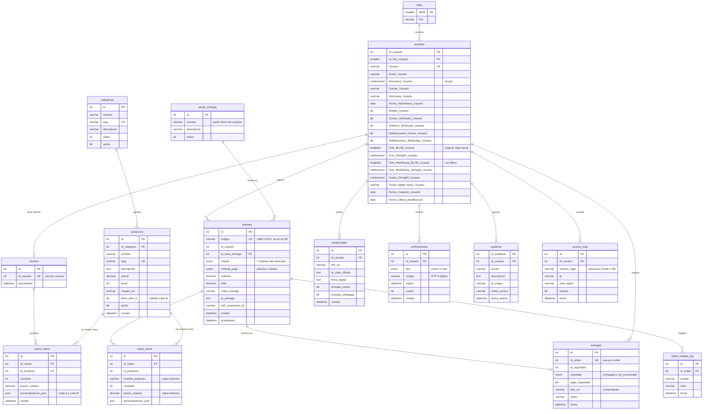

# Diagrama Entidad-Relación — UMG Personaliza

Base de datos `umg_personaliza_db` · MySQL 8.0 · 15 tablas

**Entregable:** requisito 1.1.2.7 del documento académico y punto «Diagrama de base
de datos» de la primera revisión.

> Este diagrama **no está dibujado a mano**: se generó consultando
> `information_schema` sobre la base de datos en ejecución, levantada desde cero con
> `docker compose up`. Tipos, claves e índices son los reales, no una aproximación
> del modelo previsto.
>
> Generado el 2026-08-31 sobre la rama `fix/hallazgos-auditoria`.

---

## Diagrama



---

## Relaciones declaradas como clave foránea

Doce restricciones activas en la base de datos:

| Origen | Destino | Cardinalidad |
|---|---|---|
| `usuarios.Id_Rol_Usuario` | `roles.IdRol` | N:1 |
| `productos.id_categoria` | `categorias.id` | N:1 |
| `carrito_items.id_carrito` | `carritos.id` | N:1 |
| `carrito_items.id_producto` | `productos.id` | N:1 |
| `ordenes.id_area_entrega` | `areas_entrega.id` | N:1 |
| `orden_items.id_orden` | `ordenes.id` | N:1 |
| `orden_estado_log.id_orden` | `ordenes.id` | N:1 |
| `entregas.id_orden` | `ordenes.id` | 1:1 (índice único) |
| `credenciales.id_usuario` | `usuarios.Id_Usuario` | N:1 |
| `verificaciones.id_usuario` | `usuarios.Id_Usuario` | N:1 |
| `auditoria.id_usuario` | `usuarios.Id_Usuario` | N:1 |
| `access_logs.id_usuario` | `usuarios.Id_Usuario` | N:1 |

## Relaciones que existen pero NO están declaradas

Estas cuatro columnas funcionan como clave foránea en el código, pero la base de
datos **no las verifica**. En el diagrama aparecen como relación porque
conceptualmente lo son; en `information_schema.KEY_COLUMN_USAGE` no figuran.

| Columna | Debería apuntar a | Riesgo |
|---|---|---|
| `carritos.id_usuario` | `usuarios.Id_Usuario` | Carrito huérfano si se borra el usuario |
| `ordenes.id_usuario` | `usuarios.Id_Usuario` | Orden sin comprador identificable |
| `orden_items.id_producto` | `productos.id` | Línea de orden apuntando a un producto inexistente |
| `entregas.id_repartidor` | `usuarios.Id_Usuario` | Entrega sin repartidor verificable |

**Por qué importa:** el documento académico exige integridad referencial implícita
al pedir «errores claros… de integridad referencial» y buenas prácticas de base de
datos. Hoy nada impide insertar una orden con un `id_usuario` que no existe.

**No se corrigió en esta entrega** porque añadir cuatro `FOREIGN KEY` a tablas con
datos es un cambio de esquema que merece su propia migración y sus propias pruebas.
Queda como tarea identificada, no como algo que se pasó por alto.

---

## Observaciones sobre el modelo

**Dos convenciones de nombres conviviendo.** `usuarios` y `roles` usan
`PascalCase_Con_Sufijo` (`Id_Usuario`, `Password_Usuario`, `IdRol`), mientras que
las trece tablas de la tienda usan `snake_case` (`id_usuario`, `precio_unitario`).
Refleja dos etapas del proyecto: el núcleo de autenticación facial heredado y el
módulo de comercio construido después. No es un error, pero conviene explicarlo en
la defensa antes de que lo pregunten.

**La desnormalización de `orden_items` es intencional y correcta.** Guarda
`nombre_producto` y `precio_unitario` copiados del producto. No es redundancia por
descuido: congela el precio y el nombre en el momento de la compra, de modo que
cambiar el catálogo después no altere el histórico ni las constancias ya emitidas.

**La personalización viaja como JSON.** `carrito_items.personalizacion_json` y
`orden_items.personalizacion_json` guardan el diseño de Lado A y Lado B. Evita crear
tablas por cada tipo de personalización, a costa de que la base no valide su
estructura.

**Cuatro columnas de fotografía por usuario.** `Foto_BLOB` y `Foto_String64`
(original, para el login facial) más `Foto_Modificada_BLOB` y
`Foto_Modificada_String64` (con filtros, para la credencial). Cada imagen se
almacena dos veces, en binario y en base64. Funciona, pero hace crecer la tabla
`usuarios` rápido; si el rendimiento se degrada con muchos usuarios, este es el
primer sitio donde mirar.

**El estado de la orden vive en dos lugares.** `ordenes.estado` guarda el estado
actual y `orden_estado_log` el histórico de transiciones. Es lo que permite el
tracking en vivo y deja auditable el ciclo que gobierna
`backend/utils/ordenAutomata.js`.

---

## Cómo se regenera

Si el esquema cambia, estos comandos devuelven los datos con los que se construyó
el diagrama:

```bash
# Tablas y columnas
docker compose exec -T mysql sh -c 'mysql -uroot -p"$MYSQL_ROOT_PASSWORD" \
  -e "SELECT TABLE_NAME, COLUMN_NAME, COLUMN_TYPE, COLUMN_KEY
      FROM information_schema.COLUMNS
      WHERE TABLE_SCHEMA=\"umg_personaliza_db\"
      ORDER BY TABLE_NAME, ORDINAL_POSITION;"'

# Claves foraneas declaradas
docker compose exec -T mysql sh -c 'mysql -uroot -p"$MYSQL_ROOT_PASSWORD" \
  -e "SELECT TABLE_NAME, COLUMN_NAME, REFERENCED_TABLE_NAME, REFERENCED_COLUMN_NAME
      FROM information_schema.KEY_COLUMN_USAGE
      WHERE TABLE_SCHEMA=\"umg_personaliza_db\"
        AND REFERENCED_TABLE_NAME IS NOT NULL;"'
```

El bloque `mermaid` de arriba se renderiza solo en GitHub. Para exportarlo como
imagen para la presentación, pega el bloque en <https://mermaid.live>.
